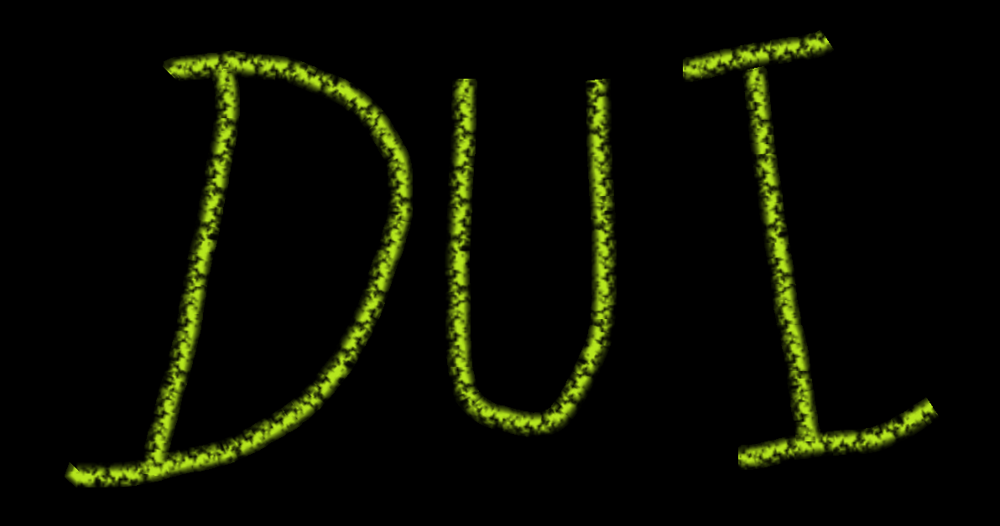

  

<h1 align="center">DanUI</h1>

  Raid tools and quality-of-life features for World of Warcraft (Retail), in one window.

  
  
  

---

DanUI is a set of small modules for raiding and everyday play. Each module can be
switched on or off on its own. All of them are configured from one themed window.
Open it with `/dan`, `/dui` or the minimap button.

## Features

### Raid

| Module | What it does |
|---|---|
| **Invites** | Auto-invites anyone who whispers a keyword (`inv`, `invite` by default). It also has an "Invite All Guild" button. When a party fills up it converts to a raid and waits for the server to confirm before sending more invites. |
| **Raid Automation** | Sets the raid difficulty for each weekday, once per raid group. If you change it by hand afterwards, your change stays. |
| **Raid Arranger** | Splits the raid into teams or groups, spreading tanks and healers evenly and filling groups in fives. |
| **Auto-Assist List** | Gives assist to the players on your list when they join your raid. |
| **RC & Pull** | Replaces the ready check prompt with a restyled one that shows your durability and has a repair bot button. It can also start a pull timer. Optionally, it whispers warlocks who have no Soulstone out. Only one DanUI client in the raid sends the whispers. |
| **Ready Check window** | A raid inspection panel with columns for food, flask, vantus rune, augment rune and each class buff for every member. The table updates live as players answer the check. |
| **Break Timer** | An on-screen countdown for BigWigs and DBM breaks. It can start a ready check automatically when the break ends. |

### Combat

| Module | What it does |
|---|---|
| **Castbar** | Replaces the player, target and focus castbars. Includes channel tick marks and support for Evoker empowered casts. |
| **Combat Timer** | Shows how long you have been in combat. |
| **Combat Alerts** | A sound and a flashing icon at a set point in the BigWigs pull countdown, plus a death alert for group members. |
| **HP Reminder** | Reminds you to use a healthstone or potion when Blizzard's low-health warning appears. |

### Interface

| Module | What it does |
|---|---|
| **Floating Buttons** | A movable bar with Pull, Ready Check, Inspect and Break buttons. You can hide any of them. |
| **LFG Filter** | Advanced group-finder filtering, built on Premade Groups Filter and styled to match DanUI. |
| **Bag Item Level** | Shows the item level on gear in Blizzard's bags. |
| **Battle Res Tracker** | Tracks shared battle-res charges and the recharge timer in raids and Mythic+. |

### Quality of life

| Module | What it does |
|---|---|
| **Guild Bank Sorter** | Sorts the guild bank into tabs using rules you set. |
| **Guild Bank Restock** | Refills your bags to target amounts from the guild bank, on the days and times you choose. *Off by default.* |
| **Warbank Gold** | Keeps each character's gold at a target amount by depositing or withdrawing from the Warband bank. Each character can have its own target. *Off by default.* |
| **AutoPayout** | Sends gold to a list of players by mail, based on Auto Payout. |
| **Automation** | Repairs your gear (with guild funds first, if allowed) and sells grey items at merchants. It also accepts summons and resurrections, and makes Release Spirit a press-and-hold action. |

### Also included

- **Theming:** you pick the accent, background and secondary colours plus the panel opacity, and every DanUI window uses them.
- **A soundpack:** the sounds are registered with LibSharedMedia, so other addons can use them as well.
- **Settings search:** type in the main window to find any setting in any module.

## Installation

DanUI is published through GitHub Releases.

- **WowUp** or **CurseBreaker:** add `https://github.com/DanUIAddon/DanUI` as a GitHub addon.
- **Manual install:** download `DanUI-<version>.zip` from the
  [latest release](https://github.com/DanUIAddon/DanUI/releases/latest) and extract it into
  `World of Warcraft/_retail_/Interface/AddOns/`. The result should be `AddOns/DanUI/DanUI.toc`.

### Optional dependencies

DanUI works on its own. It does more when these addons are installed:

- **[BigWigs](https://www.curseforge.com/wow/addons/big-wigs):** needed for the pull alert, the Break button and the break display. DBM breaks are also picked up.
- **[RaiderIO](https://www.curseforge.com/wow/addons/raiderio)** and **PremadeRegions:** add extra data to the LFG Filter.

## Commands

| Command | Action |
|---|---|
| `/dan` or `/dui` | Open or close the main window |
| `/dan resetpos` (or `/dui resetpos`) | Move all config panels back next to the main window |
| `/duirc` | Open or close the Ready Check window |
| `/duirctest` | Show a test ready check prompt |
| `/duinag` | Explain what the automatic Soulstone whisper would do right now, without sending anything. `/duinag on` or `/duinag off` turns it on or off. |
| `/duipayout` | Open or close AutoPayout |

On the minimap button, left-click opens the main window and right-click opens the Ready
Check window. Drag the button to move it around the minimap.

## Known limitations

The 12.1 client limits what addons can do, and DanUI works within those limits:

- Addons cannot read buffs during some instanced content, so the Ready Check window's buff columns can show blank there. The automatic Soulstone whisper turns itself off in that case rather than whispering every warlock.
- Some group-finder results cannot be read by addons. When that happens the LFG Filter leaves Blizzard's list unfiltered, rather than causing errors.
- Anything attached to a secure button, such as the repair bot button on the ready check prompt, cannot be shown or hidden in combat. A ready check that arrives during combat uses Blizzard's own prompt.

## Reporting a bug

Open an [issue](https://github.com/DanUIAddon/DanUI/issues). To see Lua errors, turn them on
with `/console scriptErrors 1`, or install BugSack. Please include the full error text and
the module you were using.

## Credits and license

DanUI is licensed under the [GNU General Public License v3.0 or later](LICENSE).

It includes code from other authors, including
[Premade Groups Filter](https://github.com/0xbs/premade-groups-filter) (Bernhard Saumweber),
[Auto Payout](https://github.com/Oppzippy/AutoPayout) (Oppzippy),
[PleebPotReminder](https://github.com/grimboso/PleebPotReminder) (.pleeb.) and several
common libraries. Each keeps its own license. See [CREDITS.md](CREDITS.md) for the full list.
